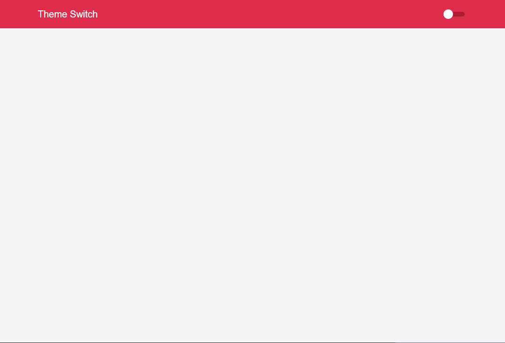

<h1 align="center">
  <strong>Theme Switch</strong>
</h1> 

<center>

<h3 align="center">
  Application link: <a>Theme Switch</a href="https://maycongc.github.io/theme-switch-react">
</h3>
<br/>

## 🎨 Layout




## ✅ Feature
- Change the application theme

## 🧰 Tools

- [ReactJS](https://pt-br.reactjs.org/)
- [React-hooks](https://pt-br.reactjs.org/docs/hooks-custom.html)
- [Styled-Components](https://styled-components.com/)


## 🔥 Como executar

- ### **Pré-requisitos**

  - **Necessário** possuir o **[Node.js](https://nodejs.org/en/)** instalado na máquina
  - **Necessário** possuir o gerenciador de pacotes **[Yarn](https://yarnpkg.com/)**.

### ✨ Faça um clone:

```bash
# Clone este repositório
$ git clone https://github.com/maycongc/theme-switch-react.git
```


### 🎲 Rodando a aplicação

```bash
# Acesse a pasta do projeto no terminal/cmd
$ cd theme-switch-react

# Instale as dependências
$ yarn

# Execute a aplicação em modo de desenvolvimento
$ yarn start

# A aplicação será aberta na porta:3000 - acesse http://localhost:3000
```

<br />
<a id="como-contribuir"></a>

# 😯 Como contribuir para o projeto

1. Faça um **fork** do projeto.
2. Crie uma nova branch com as suas alterações: `git checkout -b my-feature`
3. Salve as alterações e crie uma mensagem de commit contando o que você fez: `git commit -m "feature: My new feature"`
4. Envie as suas alterações: `git push origin my-feature`
> Caso tenha alguma dúvida confira este [guia de como contribuir no GitHub](https://github.com/firstcontributions/first-contributions)


---

<h4 align="center">
    Feito com 💜 por Maycon Gorgonha 👋🏽 <a href="https://www.linkedin.com/in/maycon-gorgonha/" target="_blank">Entre em contato!</a>
<h4>
